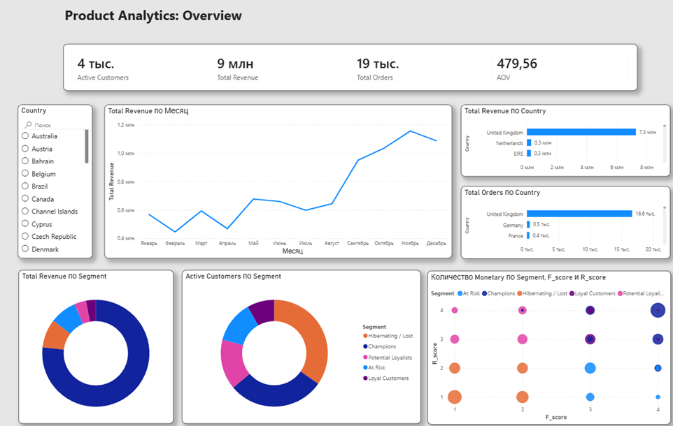

# Resume
# 👋 Привет! Я — аналитик-математик.

Ищу позицию **Data / Product Analyst**. В этом репозитории — проекты, которые показывают, как я работаю с данными: от бизнес-вопроса до практических выводов, а также мою математическую базу.

## 📁 Проекты

### 📊 [Product Analytics: Online Retail](./Product_analytics_online_retail.ipynb)
Анализ транзакционных данных интернет-магазина: 500K+ строк, ~4300 клиентов.

**Что сделано:**
- Очистка и предобработка данных (возвраты, пропуски, дубликаты)
- EDA: динамика выручки, сезонность, топ страны/товары
- Ключевые продуктовые метрики: Revenue, AOV, Repeat Purchase Rate, Active Customers
- Когортный анализ retention
- RFM-сегментация клиентов
- Парето-анализ ассортимента (80/20)
- Бизнес-рекомендации на основе находок
  
   

**Стек:** Python, Pandas, NumPy, Matplotlib, Seaborn

**Ключевые находки:** выручка сезонна с пиком в Q4, 66% клиентов совершают повторные покупки, ~21% товаров формируют 80% выручки, сегмент Champions — приоритетная аудитория для удержания.

---

### 📐 [Неравенство Чигера для мультиграфов](./Cheeger_s_inequality.pdf)
Курсовая работа (мехмат МГУ, кафедра математической теории интеллектуальных систем).

Формулировка и доказательство обобщения неравенства Чигера — одного из базовых результатов спектральной теории графов — на случай нерегулярных мультиграфов. Показывает связь между спектральными и комбинаторными свойствами графа (проводимость, кластеризация, второе собственное значение лапласиана).

**Навыки:** линейная алгебра, спектральная теория графов.

---

## 🛠️ Навыки

- **Языки/инструменты:** Python (Pandas, NumPy, Matplotlib/Seaborn), SQL
- **Аналитика:** продуктовые метрики, когортный анализ, RFM-сегментация, A/B-тесты
- **Математика:** линейная алгебра, теория графов, статистика

## 📬 Контакты

- Telegram: @Shishka5
- Email: SoM2005.02.10@yandex.ru
